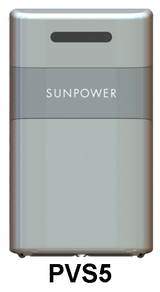
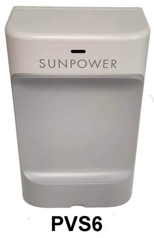
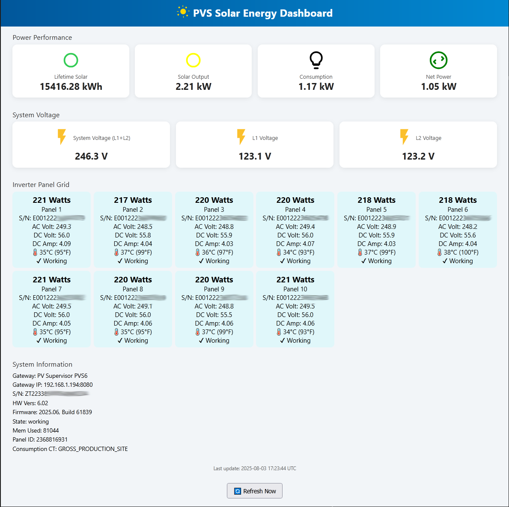
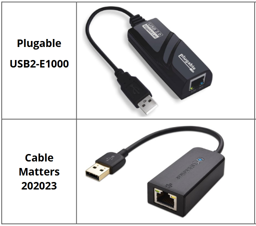

# SunPower Web Monitor

The **PVS Solar Energy Dashboard** is a web-based viewer for monitoring data from a SunPower Solar System that uses a PVS5/PVS6 Gateway. It reports the model and serial number of every provisioned device in the system. Additionally, it displays power production, power consumption, and mains voltages. Each panel in your solar array also reports its DC volts, DC amps, and Microinverter AC voltages.

> ⚠️ Note: Battery storage status is **not** currently supported. This feature will be added in the future—once a generous anonymous donor pays for the installation of a *SunVault* at the author’s residence. If you know such a person, please invite them to check out this project!

> 🔗 From this point forward, the PVS Solar Energy Dashboard will simply be referred to as the **Dashboard**.

## SunPower Bankruptcy

The 2024 SunPower bankruptcy created a great deal of uncertainty for system owners. Warranty support for purchased systems was terminated, leaving repair costs in the hands of affected customers. This situation prompted the creation of the Dashboard project, which offers system information not available in the SunPower App.

As of the Dashboard’s creation date (July 2025), the bankruptcy situation has not improved much for system  owners. SunStrong, the new company's name, recently rebranded as "SunPower." But despite the return of the SunPower name, pre-bankruptcy customers have not seen restoration of their original warranty.

## Dashboard Security

The Dashboard does not use the cloud to access your SunPower system. All communication is performed locally using a hardwired Ethernet cable.

## Dashboard Limitations

In addition to displaying useful real-time data, the Dashboard can help with system troubleshooting. Failing components can be identified without climbing on the roof or deciphering JSON-formatted files. For example, locating the serial number of a faulty microinverter is the first step toward obtaining a warranty replacement from Enphase.

However, the Dashboard **cannot** be used to commission a SunPower system or provision new devices. As of 2024, those tasks require the proprietary PVS Management App and SunPower's authorization to use it.

> 📝If your goal is to integrate your SunPower system into a home automation system, such as *Home Assistant* (HA), then keep in mind that this project is NOT needed for that. However, the Dashboard can certainly be used while you prepare your HA integration.

## PVS Gateway

The Dashboard has been tested with the PVS6 gateway and is expected to be compatible with the older PVS5 model as well. For simplicity, both models are referred to as **PVS** (Power Visualization System) in this document.

> 📝 The PVS is a data logger and gateway device used for solar system monitoring, metering, and control.

To retrieve data, a direct Ethernet connection is required. **Wi-Fi cannot be used.**

Inside the PVS are two Ethernet ports (LAN1 & LAN2) and other RJ45 jacks that **are not Ethernet**. Be cautious and use the correct port!

## LAN Port Descriptions

The two Ethernet (LAN) ports have different purposes, as follows:

### LAN1: Dashboard Data

- **LAN1** is the Ethernet port that enables Dashboard functionality.

- It was originally intended for installer use. Unfortunately, SunPower disabled the built-in PVS Management App. It was a web-based commissioning interface that allowed installers to provision or repair systems. Today, those tasks require a proprietary installer's App.

- Thankfully, the LAN1 **API** remains functional.

- The Dashboard webpage queries this API using IP address *172.27.153.1* on LAN1. This is a private network address, separated from the customer’s home network, which is why a direct Ethernet connection is required.

> 🔗 Note: The URL *www.sunpowerconsole.com* has been disabled by SunPower. It was an alias for the PVS’s internal nameserver at *172.27.153.1*. Your browser must now use the IP address as the URL ([http://172.27.153.1](http://172.27.153.1)). Only http is accepted, https is not supported.

### LAN2: Customer Cloud Data

- **LAN2** is the Ethernet port that sends data to the SunPower cloud via the customer's router. Most systems use Wi-Fi for this, but Ethernet is also supported.

- This connection enables access to power production and consumption data via the official SunPower app.

- The Dashboard uses the LAN1 port, so LAN2 is not our concern.

## Ethernet Cable Connection

Rather than repeating installation steps here, please refer to the official PVS Residential Installation *Quick Start Guide* (**QSG**) for information on where to connect the LAN1 Ethernet cable:

- **PVS6 QSG**: [[Click to view]](resources/PVS6_Installation1.pdf)
- **PVS5 QSG**: [[Click to view]](resources/PVS5_Installation1.pdf)
> 🔗 Note: The latest PVS6 hardware version will require a USB-to-Ethernet adapter (Dongle). Details are discussed in the PVS6 QSG.

## Ethernet Test

Now that you have the PVS connected to your PC, it's time to check that the Ethernet connection is working. As follows:

1. Turn off the PC's WiFi. Confirm it is off, otherwise the LAN1 test (and the Dashboard) will fail.

2. Launch your favorite browser and visit URL http://172.27.153.1

3. Confirm that a *403 Forbidden* error is displayed. It means that the IP is valid, but further access is disabled by SunPower. Despite sounding grim, the 403 error is good news.
> ⚠️If a Connection Timeout occurs then there is a problem with your Ethernet configuration or connection. Be sure WiFi is turned off!

4. Next, visit the following URL and confirm it replies with a *devices* report: 
http://172.27.153.1:8080/cgi-bin/dl_cgi?Command=DeviceList

5. If the report appears then you are ready to try the Dashboard. Congratulations, you're almost there!
> 🔗 For those interested in using the Dashboard from your existing wireless network, please see the [FAQ](#faq) section at the bottom. But for now, continue with the next section.

## Dashboard File Installation

The Dashboard is a single HTML file. Save [solar_dashboard.html](https://github.com/thomastech/SunPower-Web-Monitor/releases/download/html/solar_dashboard.html) on your PC desktop. Alternatively, store it in a subfolder and create a desktop shortcut for quick access.

> 🔗 These instructions are for Windows users. Other operating systems may slightly differ.

## Solar Energy Dashboard: Basic Operation

On a Windows PC the Dashboard can be launched by double-clicking the file (or shortcut). Be sure WiFi is turned off!

Here's a screenshot.

<a href="images/dashboard1.png" target="_blank" style="text-align: center; display: block;">
  
  
<strong>Click for Larger View</strong>

</a>
 

Some basic information:
- Data is automatically refreshed every **15 seconds**.
- You can also manually refresh the page by clicking the **yellow sun icon** at the top of the page or the **[Refresh Now]** button at the bottom.
- A timestamp above the refresh button shows the UTC time of the last update.
- The web page layout is a responsive design. It resizes to fit desktop and mobile devices.

## Solar Energy Dashboard: Data Sections

### Power Performance

The *Power Performance* section provides the following information:

**Lifetime Solar:** Total accumulated power production (KWH) since system installation.

**Solar Output:** The instantaneous power (KW) production. The circle icon will be yellow when panels are producing power. It turns blue when sunlight is insufficient.

**Consumption:** The instantaneous power (KW) consumption.

**Net Power:** The amount of net power (KW). It is power produced (Solar Output) minus power consumed. A negative value (red circle icon) indicates that more energy is being consumed than produced. The difference would need to come from the POCO (Power Company) or a SunVault. A green circle icon indicates that there is excess power which can be exported to the POCO or stored in a SunVault.

---

### System Voltage

The *System Voltage* section provides the following information:

**System Voltage L1+L2:** The solar system's AC mains line voltage as measured across the L1 & L2 phase legs. Nominal is 240VAC.

**L1 Voltage:** The L1 mains voltage. Nominal is 120VAC.

**L2 Voltage:** The L2 mains voltage. Nominal is 120VAC.

---

### Inverter Panel Grid

The *Inverter Panel Grid* shows details for each solar panel in the array(s). Panels are normally blue but will change to yellow if they have significantly lower production wattage (<80%) than other panels.

**Watts:** Instantaneous production wattage of the panel.

**S/N:** The serial number of the panel's inverter.

**AC Volt:** The AC output voltage of the inverter. Nominal is 240VAC.

**DC Volt:** The DC output voltage of the solar panel.

**DC Amp:** The DC output current of the solar panel.

**🌡️ (temperature):** The temperature of the solar panel.

**✔ (status):** The status of the solar panel. Reports either *Working* or *Error.* An Error typically means there is insufficient sunlight to produce power.

---

### System Information

The *System Information* section provides the following information:

**Gateway:** The gateway model description.

**Gateway IP:** The IP address used to access the PVS.

**SN:** The PVS unit's serial number.

**HW Vers:** The hardware version of the PVS.

**Firmware:** The firmware version of the PVS.

**State:** The runtime state of the PVS.

**Mem Used:** The amount of RAM used by the PVS, in KiB.

**Panel ID:** SunPower's customer identification number.

**Consumption CT:** The subtype assigned to the consumption Current Transformer (CT). Consumption monitoring is disabled if it reports "NOT_USED."

## [FAQ](faq)

### 1.
**Q.** Can I connect the PVS to my local network so that I can use the Dashboard from multiple devices? It would be convenient to access it via my WiFi router, especially from a browser on my smartphone.

**A.** Yes, this is a great way to use the Dashboard. For details, please review this document: [Local Network Setup.](./docs/local_network.md)

### 2.
**Q.** I followed the [Local Network Setup](./docs/local_network.md) instructions and have successfully connected the PVS to my home's network. It works great when I am at home. But how can I use the Dashboard from another location, such as when I am traveling?

**A.** What you are describing could be accomplished with your router's port forwarding feature. Most IT professionals don't promote doing this due to the security risks from bad actors. Of course, there are protection measures that can be used, but details are beyond the scope of this project. Honestly, SunPower's cloud-based monitoring app (if it still works for you) is a recommended solution for basic remote monitoring. But even cloud connections have risk, so choose your poison wisely.

### 3.
**Q.** Why doesn't the Dashboard show daily KWH or past history? It would be useful to see how much power was produced and/or consumed each day.

**A.** It sounds like you need to check out the SunPower add-on for Home Assistant. [[Click to view]](https://github.com/krbaker/hass-sunpower)

### 4.
**Q.** I cannot connect to the VPS. I've tried everything. Help.

**A.** Check again and confirm your PC's WiFi is turned off. Do NOT use https in your URL, it MUST be http. If you are using a USB-to-Ethernet "Dongle" on your PVS6 then confirm it is an approved choice.

The [PVS6 Residential Installation Quick Start Guide](resources/PVS6_Installation1.pdf) discusses the USB Dongle models that should be used (see Technical Notification section).
