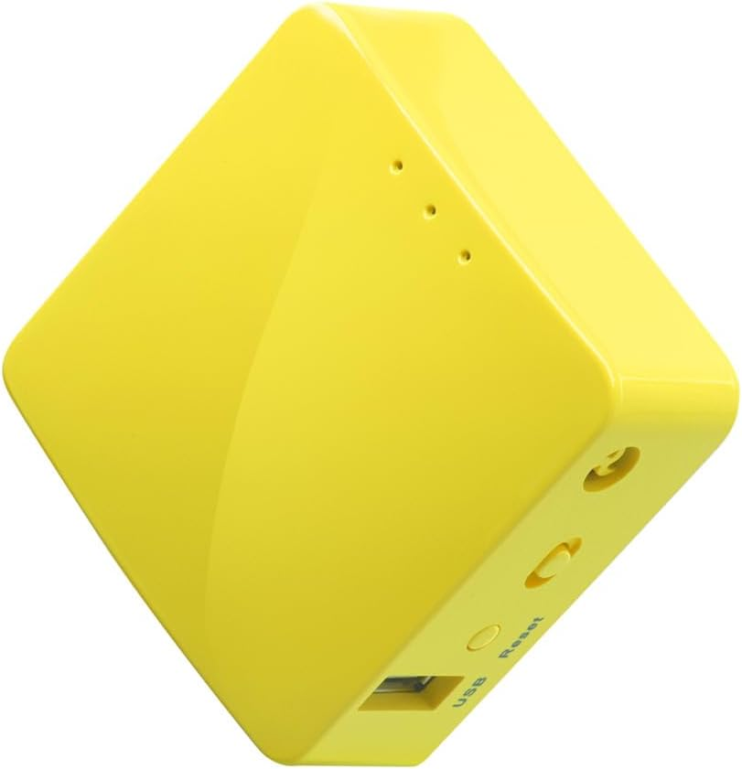
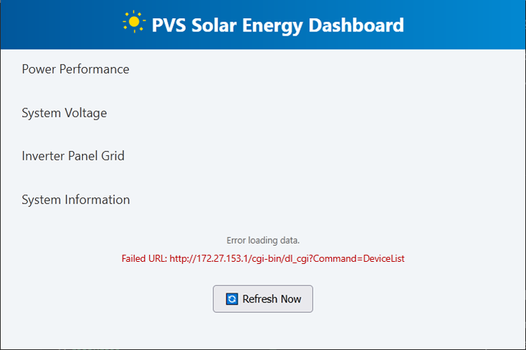

# Local Network Setup

You can set up the PVS on your local network—but not directly. While it takes a bit of extra effort, it’s worth it.

Connecting the PVS to your network isn’t a basic plug-and-play setup. That’s because the PVS's LAN1 port includes a built-in DHCP service, which conflicts with the DHCP provided by your home router. To make local access work properly, you’ll need a special router to "bridge" the PVS and your home network.

> ⚠️ Note: The Dashboard does **not** work with the Wi-Fi provided by the PVS. Because that connection is dedicated to sending data to SunPower’s cloud servers.

---

### Recommended Solution

Some solutions involve using a Raspberry Pi flashed with OpenWrt (a popular router OS). But a simpler option is to purchase a `GL.iNet GL-MT300N-V2` (**Mango**) mini VPN router. It’s affordable, extremely compact, and pre-loaded with OpenWrt.

So that’s the router solution we’ll cover here.

Configuration instructions for the Mango router are available in this guide:

- **SunPower PVS Local Monitoring Guide**: [Click to view](../resources/SunPower_PVS_Local_Monitoring.pdf)

> 📝 *Attribution: This guide is based on information from https://github.com/thedmpd/Sunpower_PVS_Guides*

---

### Connecting the Dashboard

Once you've completed the router setup, your PVS will be assigned an IP address within your home network and will respond on port `8080`.

Suppose the PVS is assigned the IP address `192.168.1.194`. To connect the Dashboard to this address, you'll add a query string to the Dashboard’s URL.

#### Example:

1. Save the HTML dashboard file somewhere on your PC or NAS. In this example, we’ll use:
   `D:\SunPower\dashboard.html`

2. Select the file (one click) to highlight it. Right-click and choose **Open with**, then select your preferred browser. The browser will open and display an empty Dashboard. After a few seconds, you'll see “Error loading data” at the bottom of the page.

   This is expected—the Dashboard defaults to the PVS’s LAN1 IP address, but it needs the Mango-assigned IP using port 8080.

   

3. Edit the browser’s address bar and append the following query string:
   `?ip=192.168.1.194:8080`

Your full URL will look like this:
``file:///D:/SunPower/dashboard.html?ip=192.168.1.194:8080``

After the Dashboad is confirmed working, save the URL as a bookmark in your browser. Now you don’t have to manually edit it each time. That's it, you're all set!

---

> 📝 Tip: Hosting `dashboard.html` on your network storage (NAS) means you won’t need to copy it to each device. Just create a bookmark pointing to the network location instead of your local hard drive. If you’ve made it this far, you definitely have the skills to make that happen!